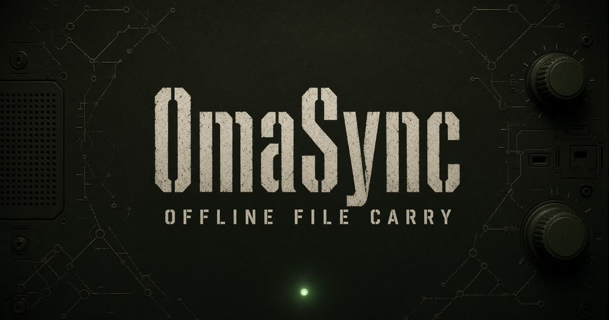

<p align="center">
  
</p>

<h1 align="center">OmaSync</h1>

<p align="center">
  <strong>Carry folders without the internet.</strong><br/>
  NAS / Omarchy → phone → Bluetooth → Dad's Android hotspot → his laptop.
</p>

<p align="center">
  <a href="https://omasync.grok.me">omasync.grok.me</a>
  ·
  <a href="https://omasync.wizwam.com">omasync.wizwam.com</a>
  ·
  <a href="https://x.com/lukejmorrison">@lukejmorrison</a>
</p>

<p align="center">
  
</p>

When you walk into a house with no WAN, the share is already on your phone. Phones hand off over Bluetooth. Dad's Omarchy joins his own hotspot, the bar icon breathes green, and he picks which files to keep.

```
Files waiting
You have a folder called Videos
click a file to keep it, then Accept
```

## Install

**Your Omarchy PC** (has internet):

```bash
git clone https://github.com/lukejmorrison/omasync.git
cd omasync
chmod +x install.sh
./install.sh --role host
```

**Dad's Omarchy laptop** — if it has no WAN, copy this folder over USB (or clone while the laptop is on a hotspot), then:

```bash
chmod +x install.sh
./install.sh --role sink
```

`install.sh` will:

1. Build `omasyncd` (Rust daemon) into `~/.local/bin`
2. Enable a systemd user service
3. Install the Omarchy 4 plugin `wizwam.omasync`
4. Put an **OmaSync icon** on the **right side of the top bar** (hover for alt text, click for the picker)
5. Add **OmaSync** to the Super-key application menu

Seed a demo offer so the chip pulses without going to Dad's:

```bash
omasyncd demo-offer
```

Middle-click (or press `o` in the panel) opens the live app. Right-click refreshes daemon status.

### Update the bar plugin only

```bash
cd ~/dev/omasync
git pull
./install.sh --plugin-only
omarchy-restart-shell
```

If the chip is missing after install:

```bash
omarchy plugin enable wizwam.omasync --section right
```

Drag the icon on the bar to move it. Super, type `OmaSync` to open the panel.

## Config

`~/.config/omasync/config.toml`

```toml
role = "host"          # host on your PC, sink on Dad's laptop
hotspot_ssid = "Dad-A15"
destination = "~/Incoming/OmaSync"
```

## Roles

| Machine | `--role` | What it does |
|---|---|---|
| Your Omarchy PC | `host` | Indexes NAS/local shares, mirrors to your phone |
| Dad's Omarchy laptop | `sink` | Joins his Android hotspot, asks which files to land |


## Phone apps (iOS + Android)

One Flutter shell. The App Store binary is the passenger (Bluetooth, hotspot, vault, notifications). The UI deploys like Rails: publish the web app, bump `shell.json`, phones pull it on the next WAN. Offline they keep the last snapshot.

```bash
cd mobile
flutter create --org com.wizwam --project-name omasync --platforms=ios,android .
flutter pub get
flutter run
```

See [mobile/README.md](mobile/README.md).
